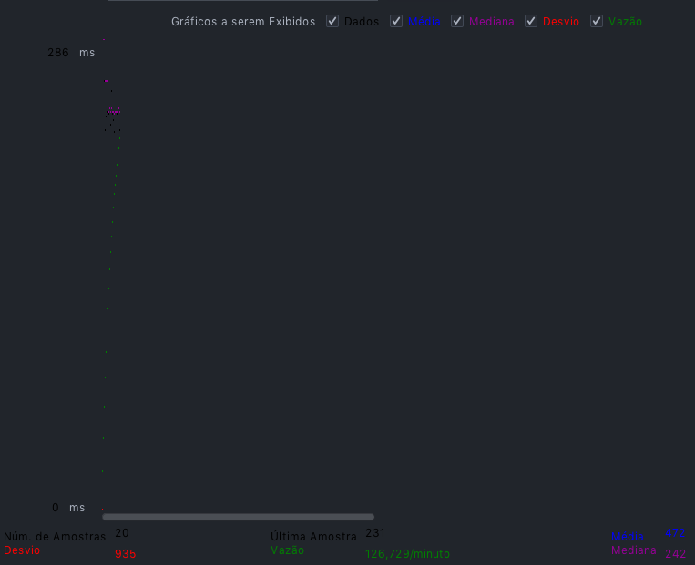

# Poll Vote API

## Proposta
No cooperativismo, cada associado possui um voto e as decisões são tomadas em assembleias, por votação. 
Esta API Backend foi criada para gerenciar essas sessões de votação.

## Funcionalidades 
* Cadastrar, Atualizar e Listar associados
* Cadastrar, Atualizar e Listar pautas
* Abrir uma sessão de votação em uma pauta (a sessão de votação deve ficar aberta por um
tempo determinado na chamada de abertura ou 1 minuto por default)
* Listar Sessões de voto   
* Receber votos dos associados em pautas (os votos são apenas 'Sim'/'Não'. Cada associado
é identificado por um id único e pode votar apenas uma vez por pauta)
* Contabilizar os votos e dar o resultado da sessão de votação na pauta

## Pré-requisitos
* Java (openjdk 15)
* Intellij Community / Eclipse
* SpringBoot
* Maven
* Docker

## Instalação
### Kafka e Banco de dados
Com o docker instalado, executar o comando abaixo pelo terminal, dentro da pasta do Docker no projeto.
````
docker-compose -f docker-compose.yml up -d
````

### Executando a API
Para realizar os testes da api é preciso ter o **Maven** e **Java 15** instalados.
````
mvn clean spring-boot:run
````
### Executando os testes da API
Para realizar os testes da api é preciso ter o **Maven** e **Java 15** instalados.
````
mvn clean test
````

## Funcionalidades
* Criar associados, pautas, sessões de votaçao e voto
* Atualizar associados e pautas
* Listar todos os associados, pautas e sessoes
* Pegar o Resultado da votação da pauta em uma sessão

## Kafka
O resultado da votação é enviado em forma de mensagem através do topico **result** com o endpoint **session/result/{id}**

## API REST HEROKU CLOUD
Para ver a documentação e usar a api, acesse [POLLVOTE-API](https://agenda-vote.herokuapp.com/swagger-ui.html).

## Teste de Performance da API
Teste de performance realizado utilizando o Apache JMeter.

O Teste foi composto de 20 requisições HTTP POST para o endpoint de voto. simulando 20 votos durante uma sessão de 1 minuto.


gráfico de tempo de resposta das requisicões.

## Versionamento
A versão da aplicação usa o formato do [Semantic Version](https://semver.org/)

* `MAJOR` - quando há um grande mudança no projeto.
* `MINOR` - Novas funcionalidades, mudanças na API.
* `PATCH` - Correção de bugs ou melhorias nas funcionalidades já existentes, que não alteram a API.
* `PATCH` - Correção de bugs ou melhorias nas funcionalidades já existentes, que não alteram a API.

## Tecnologias
* SpringBoot - O Spring foi usado pela praticidade, velocidade e simplicidade, assim tendo uma maior produtividade.
* PostgreSql - Usado ser Banco de dados simples, robusto e gratuito com integração com HerokuCloud, o que facilita muito na integracāo.
* Heroku - Usado por ser uma plataforma completa e simples de usar, com alguns plugins gratuitos como o para o postgreSQL.
* Kafka - Usado na comunicação entre microserviços  
* Docker - Foi usado para facilitar a instalação dos serviços usados

## Arquitetura
O padrāo de arquitetura MVC, foi usado por ser um padrāo com camadas definidas, e trás como benefício isolar as regras de negócios da lógica de apresentação, a interface com o usuário. Isto possibilita a existência de várias interfaces com o usuário que podem ser modificadas sem que haja a necessidade da alteração das regras de negócios, proporcionando assim muito mais flexibilidade e oportunidades de reuso das classes.